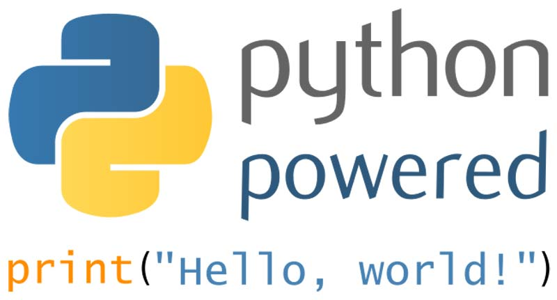
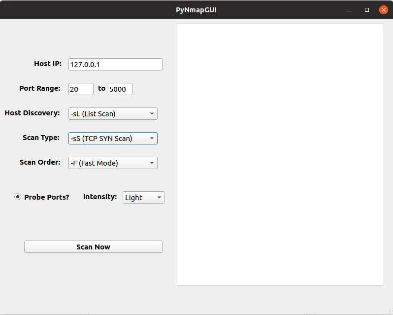

[![Issues][issues-shield]][issues-url]
[![MIT License][license-shield]][license-url]
[![LinkedIn][linkedin-shield]][linkedin-url]


<!-- PROJECT LOGO -->
<br />
<p align="center">
  <a href="https://www.python.org">
    
  </a>

  <h3 align="center">DeepMusicClassification</h3>

  <p align="center">
    An Implementation of a Convolutional Neural Network to Classify Music Genres
    <br />
    <a href="https://github.com/nlopez99/PyNmapGUI/issues">Report Bug</a>
    ·
    <a href="https://github.com/nlopez99/PyNmapGUI/issues">Request Feature</a>
  </p>
</p>


<!-- TABLE OF CONTENTS -->
## Table of Contents

* [About the Project](#about-the-project)
  * [Built With](#built-with)
* [Getting Started](#getting-started)
  * [Prerequisites](#prerequisites)
  * [Installation](#installation)
* [Usage](#usage)
* [Roadmap](#roadmap)
* [Contributing](#contributing)
* [License](#license)
* [Contact](#contact)
* [Acknowledgements](#acknowledgements)


<!-- ABOUT THE PROJECT -->
## About The Project
<p align="center">
  <a href="https://github.com/nlopez99/DeepMusicClassification">
    
  </a>
</p>

The goal of this project is to utilize the GTZAN dataset to train a convolutional neural network to classify melspectrograms into music genres.

About the model:
* The neural network topology includes 4 Convolutional layers
* The model includes batch normalization, L2 penalty for weight biases, and dropout layer to reduce overfitting
* Tensorboard callback for tracking model performance:smile:


### Built With
This section should list any major frameworks that you built your project using. Leave any add-ons/plugins for the acknowledgements section. Here are a few examples.
* [Python 3](https://www.python.org)
* [Keras](https://keras.io/)
* [TensorFlow](https://www.tensorflow.org/)


<!-- GETTING STARTED -->
## Getting Started

To get DeepMusicClassification up and running locally, [Python3.5<](https://www.python.org/downloads/release/python-374/) must be installed and added to PATH.  

### Prerequisites
Additional prerequisites to get DeepMusicClassification up and running.
* Update pip3 for most Linux ditros
```sh
sudo -H pip3 install --upgrade pip
```
* Update pip3 for Windows
```sh
python3 -m pip3 install --upgrade pip
```

### Installation

1. Clone the repo
```sh
git clone https:://github.com/nlopez99/DeepMusicClassification.git
```
2. Pip3 install packages
```sh
pip3 install -r requirements.txt
```
3. Download [GTZAN](http://opihi.cs.uvic.ca/sound/genres.tar.gz) dataset and extract it to the datasets folder


<!-- USAGE EXAMPLES -->
## Usage

To train the model run
```sh
python3 main.py -t train -d datasets/genres -e 20
```

<!-- ROADMAP -->
## Roadmap

See the [open issues](https://github.com/nlopez99/DeepMusicClassification/issues) for a list of proposed features (and known issues).


<!-- CONTRIBUTING -->
## Contributing

Contributions are what make the open source community such an amazing place to be learn, inspire, and create. Any contributions you make are **greatly appreciated**.

1. Fork the Project
2. Create your Feature Branch (`git checkout -b feature/AmazingFeature`)
3. Commit your Changes (`git commit -m 'Add some AmazingFeature'`)
4. Push to the Branch (`git push origin feature/AmazingFeature`)
5. Open a Pull Request


<!-- LICENSE -->
## License

Distributed under the MIT License. See `LICENSE` for more information.


<!-- CONTACT -->
## Contact

Nino Lopez - [@Nino_Lopez](https://twitter.com/Nino_Lopez) - antonino.lopez@spartans.ut.edu

Project Link: [https://github.com/nlopez99/PyNmapGUI/](https://github.com/nlopez99/DeepMusicClassification/)


<!-- ACKNOWLEDGEMENTS -->
## Acknowledgements
* [Keras](https://keras.io/)
* [TensorFlow](https://www.tensorflow.org/)
* [Choose an Open Source License](https://choosealicense.com)
* [GitHub Pages](https://pages.github.com)


<!-- MARKDOWN LINKS & IMAGES -->
<!-- https://www.markdownguide.org/basic-syntax/#reference-style-links -->
[issues-shield]: https://img.shields.io/github/issues/othneildrew/Best-README-Template.svg?style=flat-square
[issues-url]: https://github.com/othneildrew/Best-README-Template/issues
[license-shield]: https://img.shields.io/github/license/othneildrew/Best-README-Template.svg?style=flat-square
[license-url]: https://github.com/othneildrew/Best-README-Template/blob/master/LICENSE.txt
[linkedin-shield]: https://img.shields.io/badge/-LinkedIn-black.svg?style=flat-square&logo=linkedin&colorB=555
[linkedin-url]: https://www.linkedin.com/in/nino-lopez-tampa/
[product-screenshot]: assets/screenshot.png
